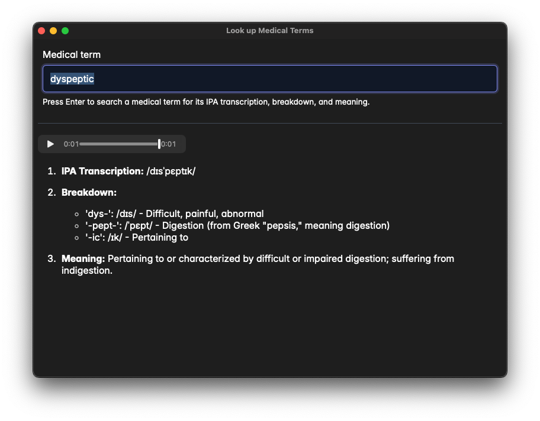

# Look up medical terms

A utility app that lets you look up medical terms, get its breakdown in terms of prefix, word root and suffix, definition, translation to another language, and audio pronunciation.

It uses Google Gemini API. You can get a free API Key, and Google Translate for pronunciation.

## Recommended IDE Setup

- [VS Code](https://code.visualstudio.com/) + [Tauri](https://marketplace.visualstudio.com/items?itemName=tauri-apps.tauri-vscode) + [rust-analyzer](https://marketplace.visualstudio.com/items?itemName=rust-lang.rust-analyzer)
